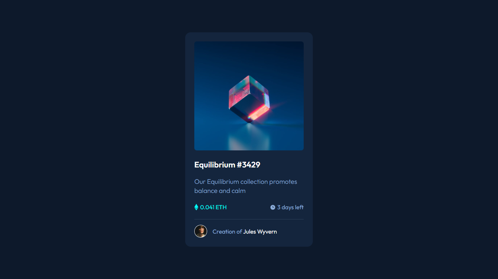
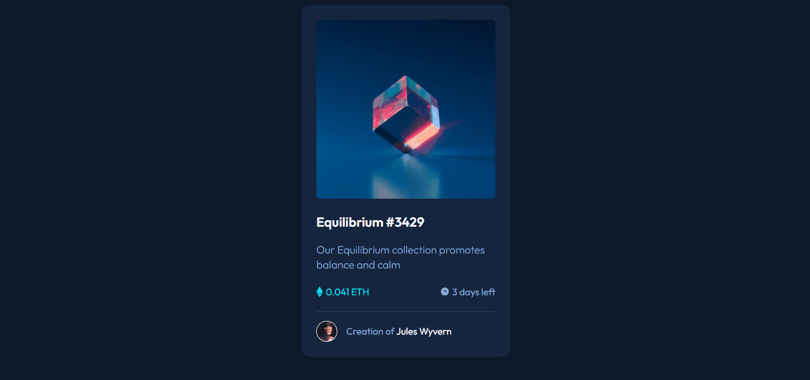

<h1 align="center">NFT preview Card Component</h1>

Vídeo aula de como criar um projeto sem travar. Exclusivo pela Dev em Dobro para praticar Front-End.

 

  

## 🚀 Tecnologias

Esse projeto foi desenvolvido com as seguintes tecnologias:

- HTML e CSS
- Git e Github
- Figma

## 💻 Projeto

O NFT Card é um cartão onde você pode ver as informações do cliente.

## Como ficou o projeto online

  

  
<a href="https://frontend-mentor-dev-em-dobro.vercel.app/" target="_blank">Clique para acessar o link</a>

## Dificuldades que tive

Ainda tenho dificuldades para fazer analises antes de começar a codar. 
Não vai existir o HTML perfeito, o CSS perfeito, o JS perfeito... Tudo dá para ser alterado e refeito.

## Assuntos que aprendi

Com esse projeto, pude abrir a mente para fazer análises antes de botar a mão na massa.
Um workshop da dev em dobro me ensinou o que deve ser feito antes de já começar a codar.

- Manter a calma
- Analisar o cada parte do projeto(Aonde vai o main, onde colocar div, tags que não precisam ser colocadas. Nesse projeto não precisa por exemplo de header e footer.)
- Pedir ajuda caso não esteja sabendo algo.
- Se não tiver figma existem outras maneiras/ferramentas de fazer o projeto.